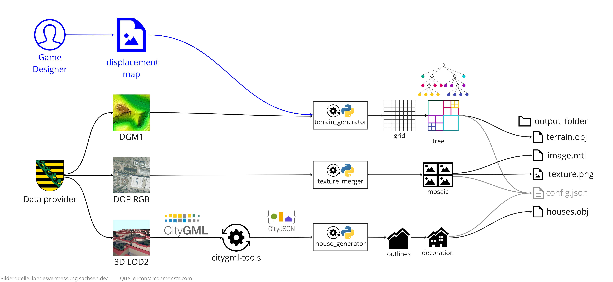
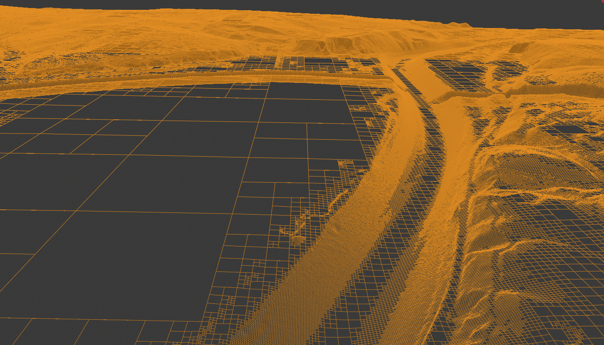
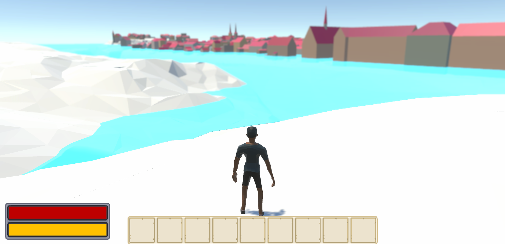
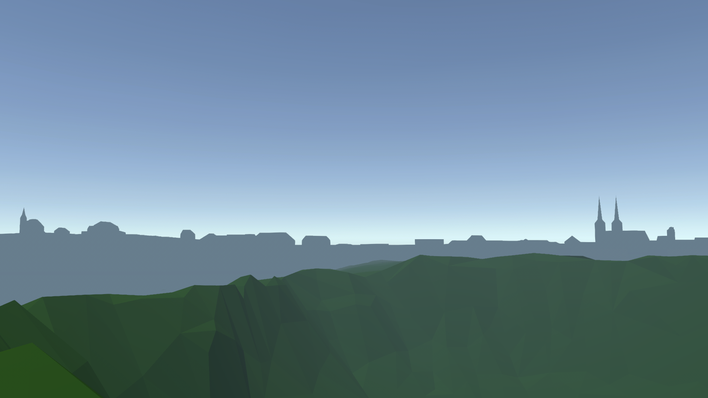

# Nykus tools
A set of tools to create virtual worlds using open geospatial data.
Used to generate the world for the game [Nykus](https://wiki.tum.de/display/infar/Nykus+Exploration) as part of the "Open Real Time Games Workshop" at TUM.

More information in the [TUM wiki](https://wiki.tum.de/display/infar/Nykus+Exploration);  [poster](https://mediatum.ub.tum.de/download/1662306/1662306.pdf) shown on the *[Nationales Forum für Fernerkundung und Copernicus](https://d-copernicus.de/infothek/veranstaltungen/nationales-forum-2022/)*





## Data preparation
1. Download the data (e.g. [dgm1](https://www.geodaten.sachsen.de/digitale-hoehenmodelle-3994.html), [dop rgb](https://www.geodaten.sachsen.de/luftbild-produkte-3995.html), [3d lod2](https://www.geodaten.sachsen.de/digitale-hoehenmodelle-3994.html)) and unpack them like this:
```
📂 example_folder
┣ 📂 dgm1_{id}_xyz
┃ ┗ 📄 dgm1_{id}.xyz
┃ ┗ 📄 dgm1_{id}_akt.csv
┣ 📂 dop20rgb_{id}_tiff
┃ ┗ 📄 dop20rgb_{id}.tif
┃ ┗ 📄 dop20rgb_{id}_akt.csv
┣ 📂 lod2_{id}_citygml
┃ ┗ 📄 lod2_{id}.gml
┃ ┗ 📄 lod2_{id}_akt.csv
```
2. Convert the citygml files into city-json using [citygml-tools](https://github.com/citygml4j/citygml-tools)
3. Run the scripts.

## Example


